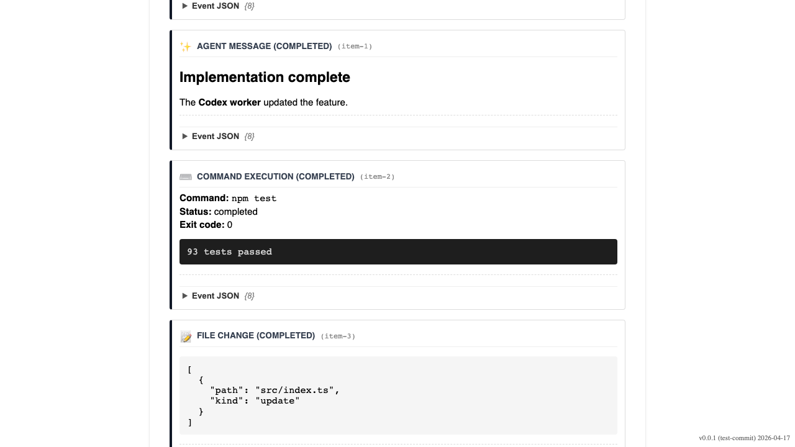

# Codex JSONL Observability

Verify that Codex CLI JSONL events are parsed and rendered as a readable workflow timeline.

## User opens the Conductor log parser

### Verifications
- [x] Debug log input is ready

---

## User inspects a Codex CLI JSONL run

### Verifications
- [x] Thread and turn lifecycle are visible
- [x] Agent markdown is rendered
- [x] Command result and file change are visible
- [x] Token usage is visible

---
