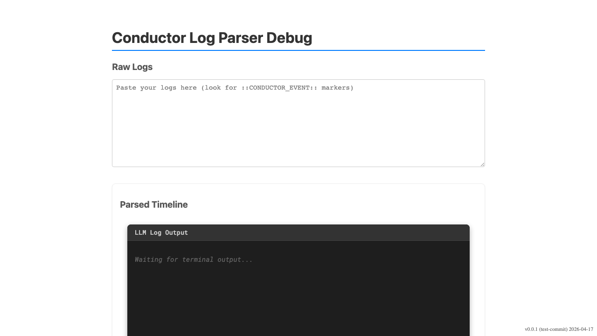
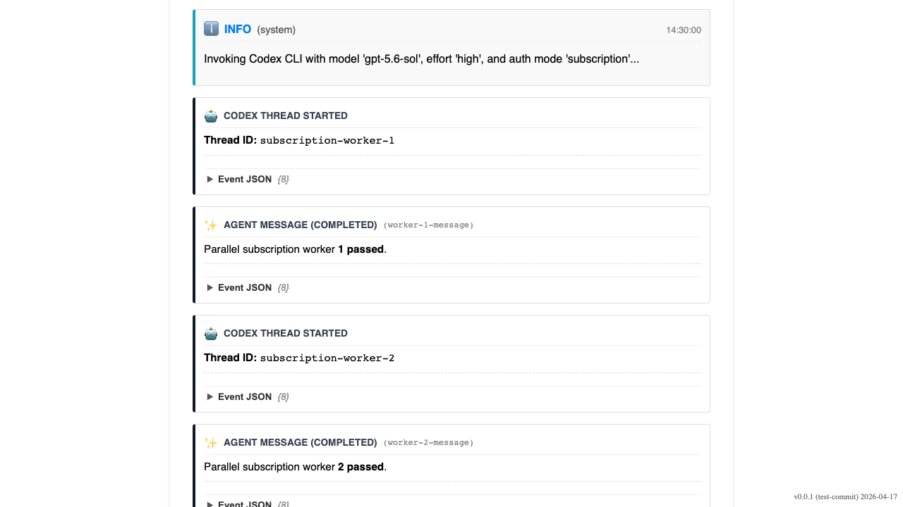

# Parallel Codex Subscription Workers

Verify that concurrent subscription-backed Codex CLI runs remain individually visible and reviewable.

## User opens the Conductor log parser for subscription workers

### Verifications
- [x] Debug log input is ready

---

## User reviews two subscription-backed Codex workers

### Verifications
- [x] Subscription authentication mode is explicit
- [x] Both worker threads are independently visible
- [x] Both workers report successful completion

---
